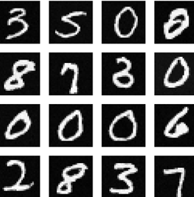
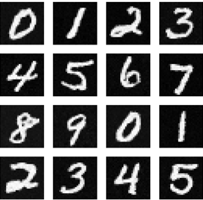

# 02456 Deep Learning project - Implementing Denoising Diffusion Probabilistic Model
---
#### Group 64
- Eva Kastelan - 232469
- Jan Ljubas - s237214
- Noa Margeta - s232470
- Filip Penzar - s232452

---

## In short

The goal of this project was to implement the denoising diffusion probabilistic model and evaluate its performance on the MNIST dataset.
In addition, we have also explored conditional ddpm's in the form of classifier-free guidance (cfg), and evaluated the performance of the models on the CIFAR-10 dataset.

#### Installing

To install the necessary packages run:

```
pip install -r requirements.txt
```

#### Main results

We outline our main results in a python notebook which can be found in [src/MAIN_RESULTS.ipynb](src/MAIN_RESULTS.ipynb).

---

#### Poster

The project poster can be found [here](poster.pdf).

## Results

DDPM results on MNIST:



CFG results on MNIST:




---

#### DTU HPC jobs

edit the jobscript-TEMPLATE.sh with your path.

- run `bsub < jobscript.sh`

- use `bstat` to see the status of your jobs

- use `bkill -JOB_ID` to delete job from queue.